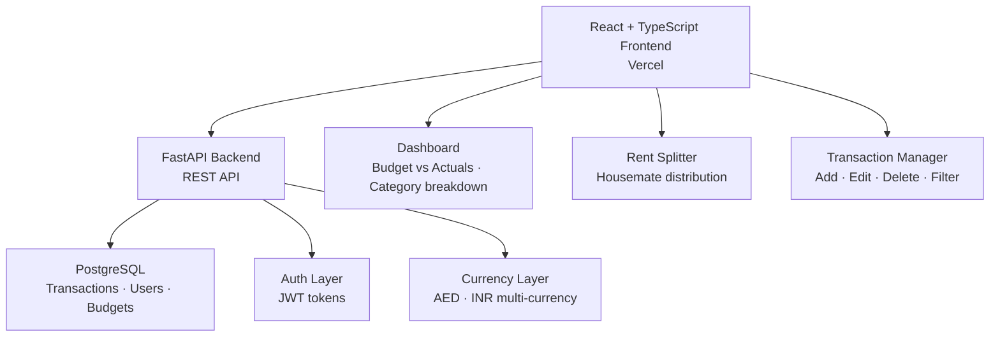

# centswise

> Multi-currency personal finance tracker with rent splits, budget analytics, and transaction management — live at centswise.vercel.app

**[Live Demo → centswise.vercel.app](https://centswise.vercel.app)** · TypeScript · React · FastAPI · PostgreSQL

---

## What it does

A personal finance SaaS that tracks income and expenses across multiple currencies, splits rent between housemates, categorises transactions, and visualises spending patterns. Users get a real-time dashboard showing budget vs actuals, category breakdowns, and distribution analytics — deployed to production with 29 deployments and counting.

## Why it's interesting

Most finance apps ignore multi-currency households or treat splitting as an afterthought. CentsWise builds rent splitting and AED/INR currency support into the core data model, not as a plugin. The FastAPI backend handles concurrent transaction creation with proper async patterns; the React frontend uses TypeScript throughout for type safety across the full stack.

---

## Architecture



---

## Tech Stack


---

## Results / Metrics

| Metric | Value |
|---|---|
| Production deployments | 29 |
| Contributors | 3 |
| Currency support | AED, INR (multi-currency) |
| Core features | Expense tracking · Rent split · Budget analytics · Category management |
| Frontend | React + TypeScript (Vercel) |
| Backend | FastAPI + PostgreSQL |

---

## Setup (local)

```bash
git clone https://github.com/Munazil1/centswise.git
cd centswise
```

Copy environment variables:

```bash
cp .env.example .env
# Fill in DATABASE_URL, SECRET_KEY
```

Backend:

```bash
cd backend
pip install -r requirements.txt
uvicorn main:app --reload
```

Frontend:

```bash
cd frontend
npm install
npm run dev
```

---

## Future Work

- Add bank statement import (PDF → transactions via OCR)
- Build a savings goal tracker with milestone notifications
- Add shared expense groups beyond rent (trips, utilities)

---

## License

MIT © Munazil V — [munazilv1@gmail.com](mailto:munazilv1@gmail.com) · [LinkedIn](https://linkedin.com/in/munazil-v-a9643a316)
